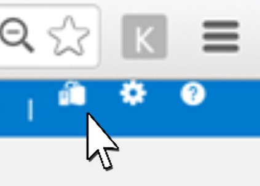
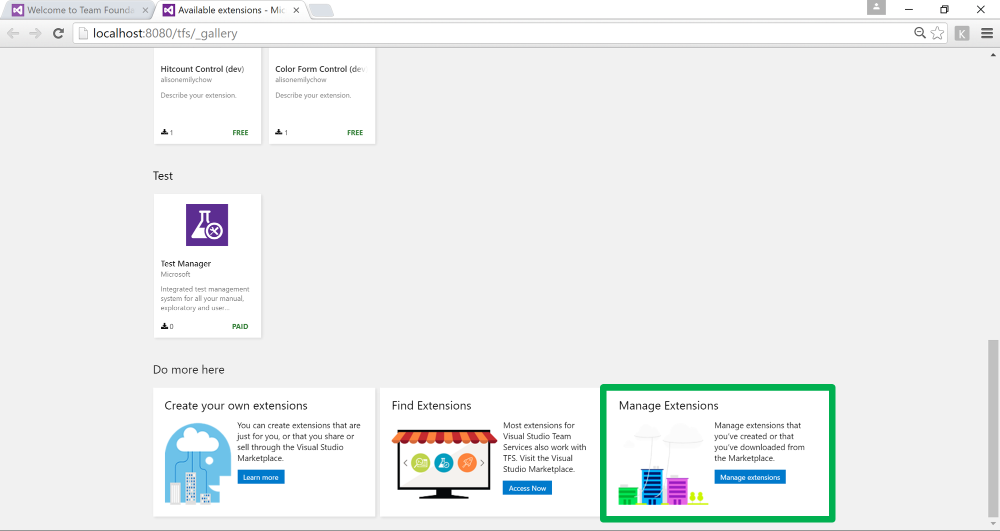
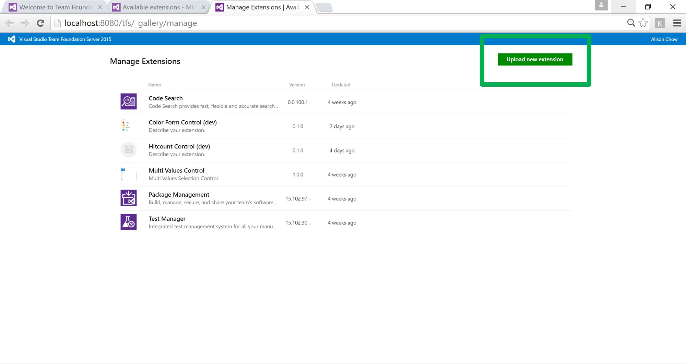
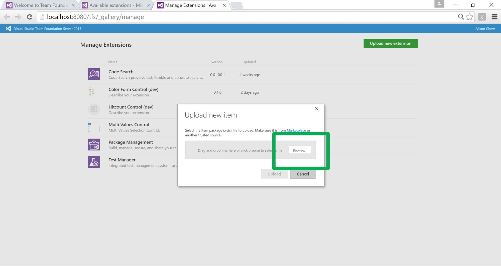
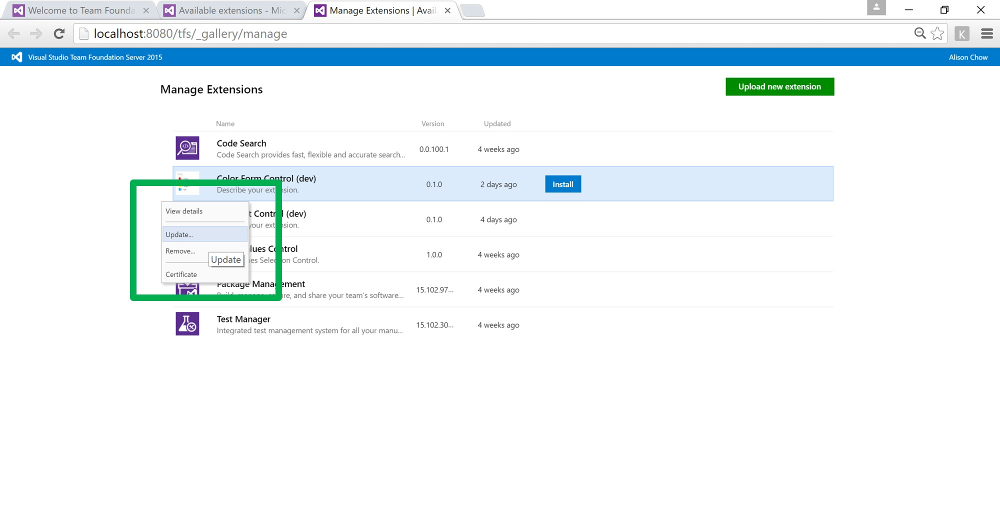
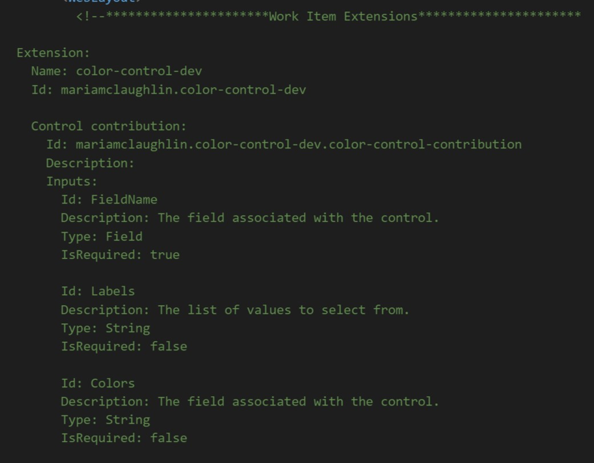
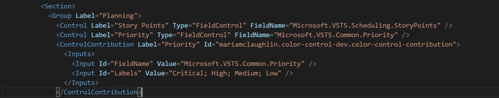

# Build a Custom Control for the Work Item Form

### **Team Services**

To add onto on premise by building an extension and importing it through XML.  You will be able to add personalization to the work item form by adjusting it to meet the needs of your team and enable it to work more efficiently.

## Before you get started
* [Clone this repo](https://github.com/cschleiden/vsts-extension-ts-seed-simple) as a starting point for writing your own extension.
* [Refer to this repo](https://github.com/microsoft/example-custom-control) as a sample custom control for the work item form.

## Begin developing your extension
The [extension manifest](https://www.visualstudio.com/en-us/docs/integrate/extensions/develop/manifest) describes your extension.  Use the file called *vss-extension.json* as your manifest.
1. Add your publisher information to the extension manifest file.
```json
    "publisher": "<your-publisher>",
```
2. Specify in the extension manifest that the contribution is for the work item form.
```json
"type": "ms.vss-work-web.work-item-form-control"
```
3. Update the file called *app.ts* to contain your publisher information.
```typescript
VSS.register("<your-publisher>.color-control-dev.color-control-contribution", provider);
```
4. Your *index.html* file should contain a call to the VSS framework in the `<head>`.
```html
<script src="scripts/VSS.SDK.min.js"></script>
```
and in the `<body>`.

```html
    <script>
        VSS.init({
            explicitNotifyLoaded: true,
            usePlatformScripts: true
        });

        // Load main entry point for extension 
        VSS.require(["scripts/app"], function () {
            // loading succeeded
            VSS.notifyLoadSucceeded();
        });
    </script>
```


5. *index.html* should also contain a call to a stylesheet.
```html
<link rel="stylesheet" href="styles/style.css" type="text/css"/>
```

## Make API calls to the work item form service

If you want to make a call to the API in a file, you must import them in the beginning.
```typescript
import * as VSSService from "VSS/Service";
import * as WitService from "TFS/WorkItemTracking/Services";
import * as ExtensionContracts from "TFS/WorkItemTracking/ExtensionContracts";
import * as Q from "q";
```

This line is also a necessary addition at the beginning of *app.ts* to enable interaction with the VSS framework.  A peek into this file will show which function calls are available.
```typescript
/// <reference path="../typings/index.d.ts" />
```

### Commonly Needed
| API                | Functions                   | Usage                                                                     |
| ------------------ | --------------------------- | ------------------------------------------------------------------------- |
| VSSService         | VSS.getConfiguration()      | Gets the inputs specified in the XML                                      |
| WitService         | getAllowedFieldValues()     | Gets the allowed values from the correct field                            |
|                    | getFieldValue()             | Gets the field's current value                                            |
|                    | setFieldValue()             | Sets the field's current value                                            |
|                    | getService()                | Get an instance of the host work item service                             |
| ExtensionContracts | IWorkItemFieldChangedArgs   | Set of fields that have been changed.  'key' is the field reference name. |


### Examples
You can get information from the work item service by creating an instance of the service, and then using one of the service's functions to obtain information about the field, and then act on it directly.  In this example, I am asking for the allowed values of a field and storing them in the variable `allowedValues`.
```typescript
WitService.WorkItemFormService.getservice().then(
        (service) => {
            service.getAllowedFieldValues(this._fieldName), (allowedValues: string[]) => {
                // do something
            }
        }
)
```
To utilize two return values from one service call, use Q.  In this example, I am asking for the allowed values and the current value associated with a field using the Q.spread function.

```typescript
WitService.WorkItemFormService.getService().then(
            (service) => {
                Q.spread<any, any>(
                    [service.getAllowedFieldValues(this._fieldName), service.getFieldValue(this._fieldName)],
                    (allowedValues: string[], currentValue: (string | number)) => {
                        //do something
                    }
                )
            }
)
```

## Test your extension locally
The simple sample repository that you cloned contains a gruntfile, meaning it has automated a few command line prompts for you.  In order to begin testing your extension, you are going to want to package your project so that it becomes a .vsix file that can be uploaded to your private Marketplace on TFS.

1. Remember to `npm install` before testing.  This will add grunt compatibilities.
2. Run `grunt package-dev` with your extension's folder as the working directory.
3. In your browser, navigate to your local instance of VSTS, `local:8080/tfs`.
4. Go to your personal Marketplace.

    

5. Scroll down and click to manage your extensions.

    

6. Click to upload your new extension.

    

7. Browse files to find the *.vsix* file that was generated when you packaged.

    

8. Once you have uploaded your extension for the first time, every time you make another change, you will repeat step 2.  
You will then right click on the extension in the "Manage Extensions" page and click update. Repeat step 7.

      

9. Next, you will need to add the extension to the work item form.  Open up the `Developer Command Prompt for VS15`.  Run the following witadmin command.
```
witadmin exportwitd /collection:http://localhost:8080/tfs/DefaultCollection /p:Agile /n:"User Story" /f:C:\Users\<your-username>\Desktop\testing.xml
```
10. This will create a file on your Desktop named *testing.xml* which contains the XML code for the entire User Story UI.

11. Locate the Extensions section.  There will be a commented out section detailing the extensions available to the work item form.  This is so that you can understand what inputs and configuration are required to implement the extension.
    
     

12. Directly below the commented section, you must add your extension tag.
```xml
<Extensions>
    <Extension Id="<your-extension-id>" />
</Extensions>
```
13. The control itself is added as a "ControlContribution" under the desired group and section.
```xml
<ControlContribution Label="<your-label>" Id="<your-control-contribution-id>"
    <Inputs>
        <Input Id="FieldName" Value="Microsoft.VSTS.Common.Priority" />
        <Input Id="Labels" Value="label; label; label" />
    </Inputs>
</ControlContribution>
```
Here is an example:



14. Finally, you must import this *.xml* file back to the form, using witadmin again.
```
witadmin importwitd /collection:http://localhost:8080/tfs/DefaultCollection /p:Agile /f:C:\Users\<your-username>\Desktop\testing.xml
``` 
If you should want to edit the instance of the control on the work item form, you can make changes to the *testing.xml* file and repeat step 14.

### Structure ###

```
/scripts            - Typescript code for extension
/img                - Image assets for extension and description
/typings            - Typescript typings

details.md          - Description to be shown in marketplace   
index.html          - Main entry point
vss-extension.json  - Extension manifest
```

### Usage ###

1. Clone the repository
1. `npm install` to install required local dependencies
2. `npm install -g grunt` to install a global copy of grunt (unless it's already installed)
2. `grunt` to build and package the application

#### Grunt ####

Three basic `grunt` tasks are defined:

* `build` - Compiles TS files in `scripts` folder
* `package-dev` - Builds the development version of the vsix package
* `package-release` - Builds the release version of the vsix package
* `publish-dev` - Publishes the development version of the extension to the marketplace using `tfx-cli`
* `publish-release` - Publishes the release version of the extension to the marketplace using `tfx-cli`

#### VS Code ####

The included `.vscode` config allows you to open and build the project using [VS Code](https://code.visualstudio.com/).

#### Unit Testing ####

The project is setup for unit testing using `mocha`, `chai`, and the `karma` test runner. A simple example unit test is included in `scripts/logic/messageHelper.tests.ts`. To run tests just execute:

```
grunt test
```
