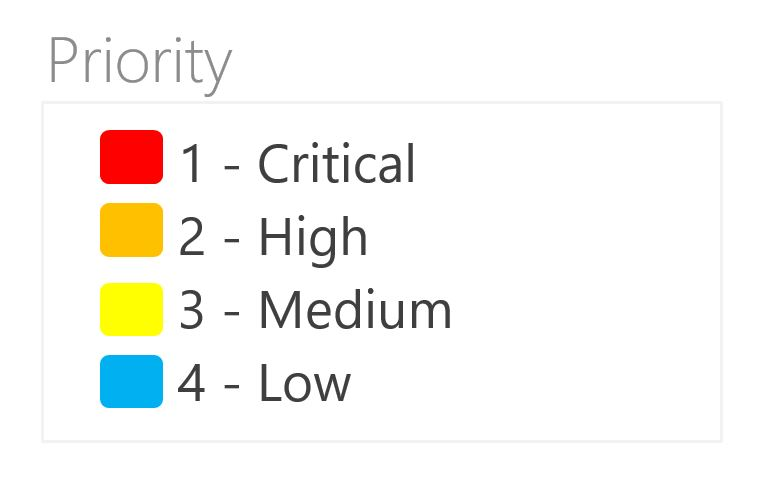

# Custom Control for the Work Item Form

[Learn how to build your own custom control for the work item form.](https://www.visualstudio.com/en-us/docs/integrate/extensions/develop/custom-control)

 

### Usage ###

1. Clone the repository.
2. Open the Command Prompt and change to the directory where you cloned the project.  For instance, if it is cloned in a folder called "extensions" and saved as "vsts-sample-wit-custom-control", you will navigate to the following command line.

        > cd C:\extensions\vsts-sample-wit-custom-control
        
1. Run `npm install` to install required local dependencies.
2. Run `npm install -g grunt` to install a global copy of grunt (unless it's already installed).
2. Run `grunt package-dev`.
3. In your browser, navigate to your local instance of TFS, `http://YourTFSInstance:8080/tfs`.
4. Go to your personal Marketplace.
6. Click the Marketplace icon in the upper righthand corner.
7. Click "Browse local extensions" in the dropdown.
7. Scroll down and click on the "Manage Extensions" widget.
8. Click the button "Upload new extension".
9. Browse to the *.vsix* file generated when you packaged your extension.
10. Select the extension, and then click "Open".  Click "Upload" when the button activates.
11. Hover over the extension when it appears in the list, and click "Install".

You have now installed the extension inside your collection.  You are now able to put the control on the work item form.

 A work item type is defined by XML, including the layout of the work item form.  As part of the walkthrough, you will add the control to the layout.  [Read more information on WebLayout XML](https://www.visualstudio.com/docs/work/reference/weblayout-xml-elements).  In this example, we will add the control to the Agile "user story".

1.  Open the `Developer Command Prompt`.  Export the XML file to your desktop with command shown below.
    ```
    witadmin exportwitd /collection:CollectionURL /p:Project /n:TypeName /f:FileName
    ```
2. This creates a file in the directory that you specified.  Inside this file, navigate to the section called "Work Item Extensions".  This section shows the documentation of the control such as the inputs and ids.  All this information was defined in the manifest, *vss-extension.json*.

    ```xml
        <!--**********************************Work Item Extensions***************************

    Extension:
        Name: color-control-dev
        Id: example.color-control-dev

        Control contribution:
            Id: example.color-control-dev.color-control-contribution
            Description:
            Inputs:
                Id: FieldName
                Description: The field associated with the control.
                Type: Field
                IsRequired: true

                Id: Colors
                Descriptions: The colors that match the values in the control.
                Type: String
                IsRequired: false
    ```

4. Add an extension tag below the "Work Item Extensions" section as shown below to make your control available to work item form. 

     ```xml
        <!--**********************************Work Item Extensions***************************
        ...

        Note: For more information on work item extensions use the following topic:
        http://go.microsoft.com/fwlink/?LinkId=816513
        -->

        <Extensions>
            <Extension Id="example.color-control-dev" />
        </Extensions>
     ```

5. Find your extension ID in the "Work Item Extensions" section: 

    ```XML
        <!--**********************************Work Item Extensions***************************

    Extension:
        Name: color-control-dev
        Id: example.color-control-dev
        ...
    ```

6. This extension is a contribution, so you add it with a contribution tag in place of the <Control> tag. This example adds the "ControlContribution" to the "Planning" group.
    ```xml
    <Page Id="Details">
    ...
        <Section>
        ...
            <Group Id="Planning">
            ...
                <ControlContribution Label="Priority" Id="<your-control-contribution-id>"
                    <Inputs>
                        <Input Id="FieldName" Value="Microsoft.VSTS.Common.Priority" />
                    </Inputs>
                </ControlContribution>

                <Control Label="Risk" Type="FieldControl" FieldName="Microsoft.VSTS.Common.Risk" />
    ```

7. Finally, import this *.xml* file, using witadmin. 
    ```
    witadmin importwitd /collection:CollectionURL /p:Project /f:FileName
    ``` 

## Make changes to the control

 If you make changes to your extension files, you need to compile the Typescript and create the *.vsix* file again (steps 4-7 in the "Package & Upload to the marketplace" section).
 
Instead of re-installing the extension, you can replace the extension with the new *.vsix* package.  Right-click the extension in the "Manage Extensions" page and click "Update".  You do not need to make changes to your XML file again.

## Make API calls to the work item form service

Reading data from VSTS/TFS server is a common REST API task for a work item control.  The VSS SDK provides a set of services for these REST APIs.  To use the service, import it into the typescript file.

```typescript
import * as VSSService from "VSS/Service";
import * as WitService from "TFS/WorkItemTracking/Services";
import * as ExtensionContracts from "TFS/WorkItemTracking/ExtensionContracts";
import * as Q from "q";
```

To enable Intellisense in Visual Studio Code, include the type definition file *index.d.ts*.  Once you've added this definition file, it shows all functions available in the VSS SDK.
```typescript
/// <reference path="../typings/index.d.ts" />
```

## Commonly Needed
| API                | Functions                   | Usage                                                                     |
| ------------------ | --------------------------- | ------------------------------------------------------------------------- |
| VSSService         | VSS.getConfiguration()      | Returns the XML which defines the work item type.  Used in the sample to read the inputs of the control to describe its behavior.       |
| WitService         | getService()                | Returns an instance of the server to make calls.                     |
|                    | getFieldValue()             | Returns the field's current value.                                    |
|                    | setFieldValue()             | Returns the field's current value using your control.       |
|                    | getAllowedFieldValues()     | Returns the allowed values, or the items in a dropdown, of a field.                                    |


### How to invoke methods on a service call
 Create an instance of the work item service to get information about the work item.  Use one of the service's functions to get information about the field.  This example asks for the allowed values of a field.
```typescript
WitService.WorkItemFormService.getservice().then(
        (service) => {
            service.getAllowedFieldValues(this._fieldName), (allowedValues: string[]) => {
                // do something
            }
        }
)
```

### Recommendation: use Q with service calls
To wait on the response of multiple calls, you can use Q.  This example shows how to ask for the allowed values and the current value associated with a field using the Q.spread function.  You can make two parallel requests, and the code will not be executed until both services have returned a response.

```typescript
WitService.WorkItemFormService.getService().then(
            (service) => {
                Q.spread<any, any>(
                    [service.getAllowedFieldValues(this._fieldName), service.getFieldValue(this._fieldName)],
                    (allowedValues: string[], currentValue: (string | number)) => {
                        //do something
                    }
                )
            }
)
```

### Structure ###

```
/scripts            - Typescript code for extension
/img                - Image assets for extension and description
/typings            - Typescript typings

index.html          - Main entry point
vss-extension.json  - Extension manifest
```

#### Grunt ####

Five basic `grunt` tasks are defined:

* `build` - Compiles TS files in `scripts` folder
* `package-dev` - Builds the development version of the vsix package
* `package-release` - Builds the release version of the vsix package
* `publish-dev` - Publishes the development version of the extension to the marketplace using `tfx-cli`
* `publish-release` - Publishes the release version of the extension to the marketplace using `tfx-cli`

#### VS Code ####

The included `.vscode` config allows you to open and build the project using [VS Code](https://code.visualstudio.com/).

#### Unit Testing ####

The project is setup for unit testing using `mocha`, `chai`, and the `karma` test runner. A simple example unit test is included in `scripts/logic/messageHelper.tests.ts`. To run tests just execute:

```
grunt test
```
